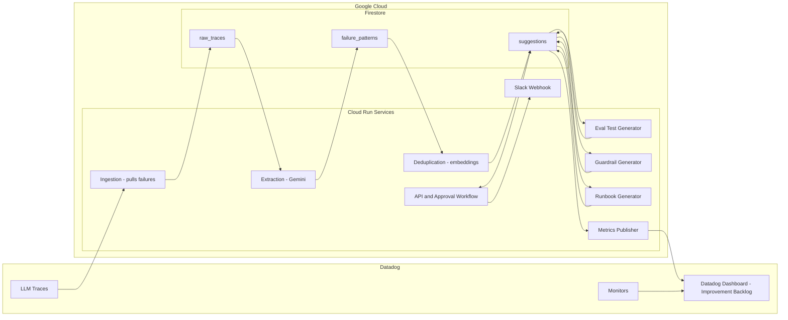

# Incident-to-Insight Loop

> Transform LLM production failures into eval test cases, guardrail rules, and runbook entries — automatically.

[](https://devpost.com)
[](https://datadoghq.com)
[](https://cloud.google.com)

## 🎯 The Problem

**66% of organizations want AI that learns from feedback, but none have systematic pipelines to make it happen.**

When LLM agents fail in production:
- Incidents get investigated, then forgotten
- The same failures repeat weeks later
- Eval suites don't grow from real-world failures
- Runbooks don't exist for LLM-specific failure modes
- Teams fight the same fires over and over

## 💡 Our Solution

**Incident-to-Insight Loop** closes the feedback gap by automatically transforming every Datadog LLM trace failure into three actionable outputs:

1. **📝 Eval Test Cases** — Reproducible tests ready to add to CI/CD
2. **🛡️ Guardrail Rules** — Suggested rules to prevent recurrence
3. **📖 Runbook Entries** — Structured diagnosis and remediation steps

## 🏗️ Architecture

Source: `docs/architecture.mmd`



## 🚀 Quick Start

### Prerequisites

**Required (local):**
- Python 3.11+
- Docker + Docker Compose

**Optional (for full end-to-end demo):**
- Datadog API + App keys (to ingest real failures)
- Google Cloud credentials (Application Default Credentials) for Vertex AI/Gemini + embeddings
- `jq` (pretty-print JSON in examples)

### Environment Setup

```bash
# Clone the repository
git clone https://github.com/sdamache/evalforge.git
cd evalforge

# Create virtual environment
python -m venv evalforge_venv
source evalforge_venv/bin/activate  # On Windows: evalforge_venv\Scripts\activate

# Install dependencies
pip install -e ".[dev]"

# Copy environment template
cp .env.example .env
# Edit .env with your credentials
```

### Configuration

We recommend using `.env.example` as your starting point (it contains safe placeholders so services can boot locally).

Update these values to enable the full end-to-end loop:

```bash
# Datadog
DATADOG_API_KEY=your_api_key
DATADOG_APP_KEY=your_app_key
DATADOG_SITE=datadoghq.com

# Approval workflow (required for non-health approval endpoints)
APPROVAL_API_KEY=your_secret_api_key
# Optional: Slack notifications on approve/reject
SLACK_WEBHOOK_URL=https://hooks.slack.com/services/...

# Google Cloud
GOOGLE_CLOUD_PROJECT=your_project_id
GOOGLE_APPLICATION_CREDENTIALS=path/to/service-account.json

# Firestore
FIRESTORE_COLLECTION_PREFIX=i2i_

# Vertex AI
VERTEX_AI_LOCATION=us-central1
GEMINI_MODEL=gemini-2.5-flash
```

### Running Locally

```bash
# Start the local stack (Firestore emulator + services)
docker-compose up --build

# Or run individual services

# Ingestion service (port 8001) - fetches Datadog traces
python -m src.ingestion.main

# Extraction service (port 8002) - extracts failure patterns
python -m src.extraction.main

# API service (port 8000) - approval workflow
python -m src.api.main

# Eval test generator service (port 8004) - turns suggestions into eval test drafts
python -m src.generators.eval_tests.main
```

Expected local ports:

- API (capture queue): `http://localhost:8000`
- Approval workflow: `http://localhost:8000/approval`
- Ingestion: `http://localhost:8001`
- Extraction: `http://localhost:8002`
- Deduplication: `http://localhost:8003`
- Eval test generator: `http://localhost:8004`
- Firestore emulator: `http://localhost:8086`

Sanity-check health endpoints:

```bash
curl -s http://localhost:8000/health
curl -s http://localhost:8000/approval/health
curl -s http://localhost:8001/health
curl -s http://localhost:8002/health
curl -s http://localhost:8003/health
curl -s http://localhost:8004/health
```

#### Troubleshooting

- **Ingestion fails**: `DATADOG_API_KEY` and `DATADOG_APP_KEY` must be non-empty. Use real keys to pull real traces; placeholders are fine for booting the service.
- **Approval endpoints return 401**: set `APPROVAL_API_KEY` in `.env` and pass `X-API-Key: $APPROVAL_API_KEY` (health endpoints do not require auth).
- **Vertex AI calls fail (extraction/dedup/generators)**: authenticate with Application Default Credentials (e.g., `gcloud auth application-default login`) and ensure credentials are available to the containers (Compose mounts `~/.config/gcloud`).
- **Firestore errors**: ensure the emulator is running (`http://localhost:8086`) and `FIRESTORE_EMULATOR_HOST` is set when running services outside Docker.

#### Running Extraction Service

The extraction service processes captured failure traces and extracts structured patterns using Gemini:

```bash
# 1. Start extraction service
python -m src.extraction.main
# Service starts on http://localhost:8002

# 2. Trigger manual extraction run
curl -X POST "http://localhost:8002/extraction/run-once" \
  -H "Content-Type: application/json" \
  -d '{"batchSize":50,"triggeredBy":"manual"}'

# Or use helper script
./scripts/run_extraction_once.sh

# 3. Check results in Firestore
# - Input: evalforge_raw_traces (processed=true after extraction)
# - Output: evalforge_failure_patterns (one per source_trace_id)
```

For detailed extraction setup, see [Extraction Quickstart](specs/002-extract-failure-patterns/quickstart.md).

#### Running Eval Test Generator Service

The eval test generator turns eval-type suggestions into framework-agnostic JSON eval test drafts:

```bash
# 1. Start eval test generator service
python -m src.generators.eval_tests.main
# Service starts on http://localhost:8004

# 2. Trigger a batch generation run
curl -X POST "http://localhost:8004/eval-tests/run-once" \
  -H "Content-Type: application/json" \
  -d '{"batchSize":20,"triggeredBy":"manual"}'

# 3. Generate/regenerate a single suggestion (overwrite guarded)
curl -X POST "http://localhost:8004/eval-tests/generate/sugg_abc123" \
  -H "Content-Type: application/json" \
  -d '{"forceOverwrite": false, "triggeredBy":"manual"}'

# 4. Fetch the current draft + approval metadata
curl "http://localhost:8004/eval-tests/sugg_abc123"
```

For detailed setup and operational notes, see [Eval Test Generator Quickstart](specs/004-eval-test-case-generator/quickstart.md).

### 🌥️ GCP Cloud Deployment

Deploy to Google Cloud Run with automated infrastructure provisioning:

```bash
# 1. Set your GCP project (with billing enabled)
export GCP_PROJECT_ID="your-project-id"

# 2. Bootstrap GCP infrastructure (APIs, service account, secrets, Firestore)
./scripts/bootstrap_gcp.sh

# 3. Update Datadog secrets with actual credentials
echo -n "your-api-key" | gcloud secrets versions add datadog-api-key --data-file=- --project=$GCP_PROJECT_ID
echo -n "your-app-key" | gcloud secrets versions add datadog-app-key --data-file=- --project=$GCP_PROJECT_ID

# 4. Deploy to Cloud Run with scheduled triggers
./scripts/deploy.sh

# 5. Verify deployment
gcloud scheduler jobs run evalforge-ingestion-trigger --location=us-central1 --project=$GCP_PROJECT_ID
```

For detailed instructions, see [GCP Quickstart Guide](specs/011-gcp-infra-automation/quickstart.md).

### Creating Synthetic Datadog LLM Traces

We ship `scripts/generate_llm_trace_samples.py` so you can unblock development before live LLM traffic exists.

```bash
# Generate 5 sanitized traces and write them to tests/data/datadog_llm_trace_samples.json
python3 scripts/generate_llm_trace_samples.py --count 5

# Emit YAML instead of JSON so you can edit payloads in an IDE
python3 scripts/generate_llm_trace_samples.py --count 2 --format yaml --output /tmp/sample_traces.yaml

# Push the same traces into a Datadog trial org (requires ddtrace + API key)
DD_API_KEY=xxx python3 scripts/generate_llm_trace_samples.py --upload --count 3 --ml-app evalforge-demo
```

- Use `--site datadoghq.eu` or another site suffix to match your trial region.
- The pytest fixture reads `tests/data/datadog_llm_trace_samples.json` by default. Override the path with
  `DATADOG_TRACE_FIXTURE=/path/to/file.json pytest …` when you want to inspect different datasets.

## 📚 API Reference

Canonical OpenAPI contracts (source-of-truth) live under each feature spec:

- `specs/001-capture-datadog-failures/contracts/ingestion-openapi.yaml` (base URL: `http://localhost:8001`)
- `specs/002-extract-failure-patterns/contracts/extraction-openapi.yaml` (base URL: `http://localhost:8002`)
- `specs/003-suggestion-deduplication/contracts/deduplication-openapi.yaml` (base URL: `http://localhost:8003`)
- `specs/004-eval-test-case-generator/contracts/eval-generator-openapi.yaml` (base URL: `http://localhost:8004`)
- `specs/008-approval-workflow-api/contracts/approval-api-openapi.yaml` (base URL: `http://localhost:8000/approval`)

## 📁 Project Structure

```
evalforge/
├── src/
│   ├── ingestion/          # Datadog trace ingestion service
│   ├── extraction/         # Gemini-powered pattern extraction
│   ├── generators/         # Eval, guardrail, runbook generators
│   ├── api/                # REST API for approval workflow
│   ├── dashboard/          # Datadog dashboard widgets
│   └── common/             # Shared utilities
├── tests/                  # Test suite
├── docs/                   # Documentation
├── scripts/                # Utility scripts
├── .github/
│   ├── workflows/          # CI/CD pipelines
│   └── ISSUE_TEMPLATE/     # Issue templates
├── Dockerfile
├── docker-compose.yml
├── pyproject.toml
└── README.md
```

## 🎬 Demo Scenario

**Before Incident-to-Insight Loop:**
1. E-commerce agent recommends discontinued product
2. Customer complains, support escalates
3. Engineer investigates Datadog trace, writes incident report
4. Three weeks later: same failure, different product
5. No one remembers the first incident

**After Incident-to-Insight Loop:**
1. Same failure occurs
2. Within minutes, engineer sees in dashboard:
   - ✅ Auto-generated eval case ready to add to CI/CD
   - ✅ Suggested guardrail: "Block recommendations for stale products"
   - ✅ Runbook draft: "Inventory staleness failures - diagnosis steps"
3. One-click approve → Next deployment includes the fix
4. **Feedback loop closed. System gets stronger.**

## 🛠️ Tech Stack

| Component | Technology |
|-----------|------------|
| Runtime   | Python 3.11 |
| API Framework | FastAPI |
| Cloud Platform | Google Cloud Run |
| AI/ML | Vertex AI (Gemini 2.5 Flash) |
| Database | Firestore |
| Observability | Datadog LLM Observability |
| CI/CD | GitHub Actions |

## 📊 Milestones

- [x] Week 1: Foundation (Trace ingestion, Pattern extraction, Storage)
- [ ] Week 2: Core Generators (Eval, Guardrail, Runbook)
- [ ] Week 3: Integration (Dashboard, Approval API)
- [ ] Week 4: Demo and Polish

## 🔭 What's Next

- Ship guardrail + runbook generators into the local `docker-compose.yml` stack for true end-to-end runs
- Tighten the evidence trail: persist prompt hashes + model response hashes for each generator step
- Add dashboard automation: publish Firestore-derived backlog metrics into Datadog on a schedule
- Add export adapters: generate CI-ready artifacts for common eval/guardrail frameworks (while keeping a framework-agnostic JSON source)
- Multi-tenant support: isolate data by tenant and add safe retention policies for artifacts

## 🤝 Contributing

This is a hackathon project! Feel free to open issues or PRs.

## 📜 License

MIT License - see [LICENSE](LICENSE) for details.

## 🙏 Acknowledgments

- **AI Partner Catalyst: Accelerate Innovation Hackathon**
- **Datadog** for LLM Observability
- **Google Cloud** for Vertex AI and Cloud Run

---

Built with ❤️ for the AI Partner Catalyst Hackathon
